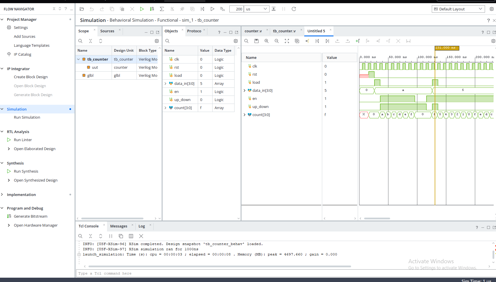

# HW2

count - це reg, а будь-який reg у Verilog до першого присвоєння має значення X (unknown); до моменту, коли rst стає 1 і асинхронно записує в нього 0, жодне присвоєння ще не відбулось - тому симулятор показує X.

