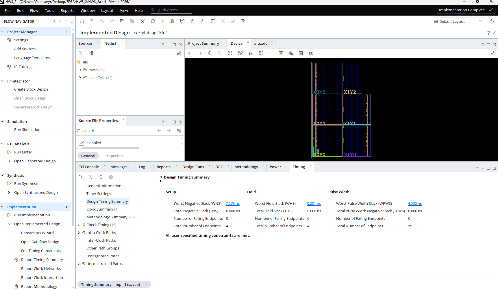
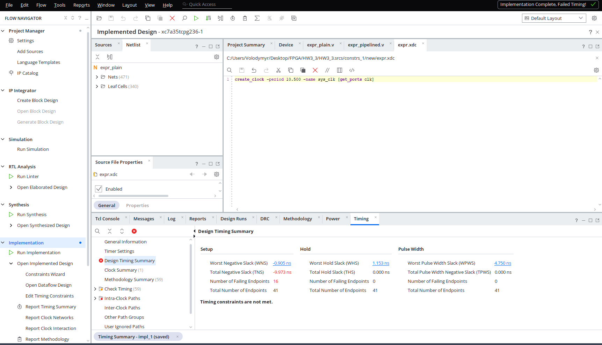
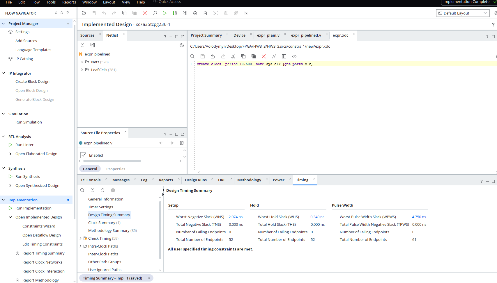

# HW3 - FSM + STA

## Частина 1 - контролер замка (`HW3_1`)

Код 5-3-7, чотири стани, три `always`-блоки (реєстр стану / переходи / вихід). Файли: `lock_controller.v`, `debounce.v`, `lock_top.v`, testbench-и в `sim_1`.

## Частина 2 - Timing Summary для `alu.v` (`HW3_2`)

`alu.xdc`: `create_clock -period 10.000 -name sys_clk [get_ports clk]`

Після Run Implementation - WNS = 7.573 ns, усі обмеження виконано:

## Частина 3 - конвеєризація (`HW3_3`)

Власний вираз `result = (a*b + c*d) * (a + d)` у двох варіантах: `expr_plain.v` (усе за один такт) і `expr_pipelined.v` (проміжний регістр між двома поверхами операцій). Входи та вихід реєстрові.

`expr.xdc`: `create_clock -period 10.500 -name sys_clk [get_ports clk]` - той самий для обох.

`expr_plain` - WNS = -0.905 ns, обмеження не виконано:

`expr_pipelined` - WNS = +2.074 ns, усі обмеження виконано:

