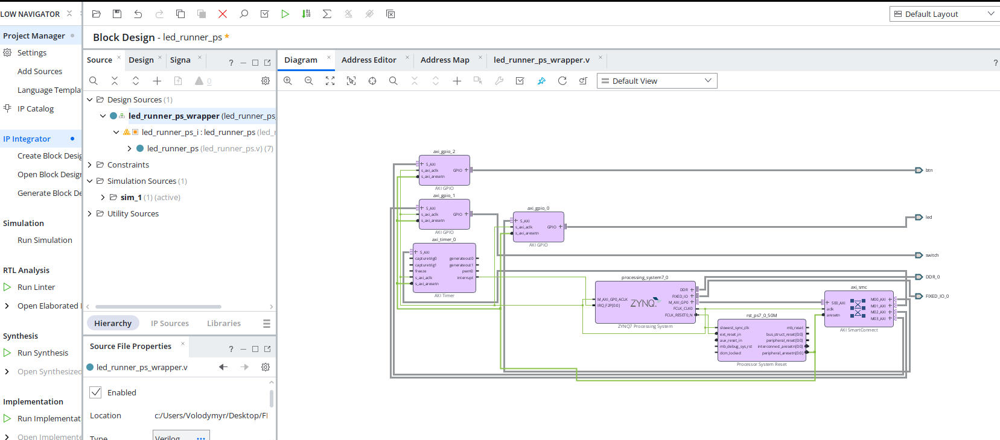
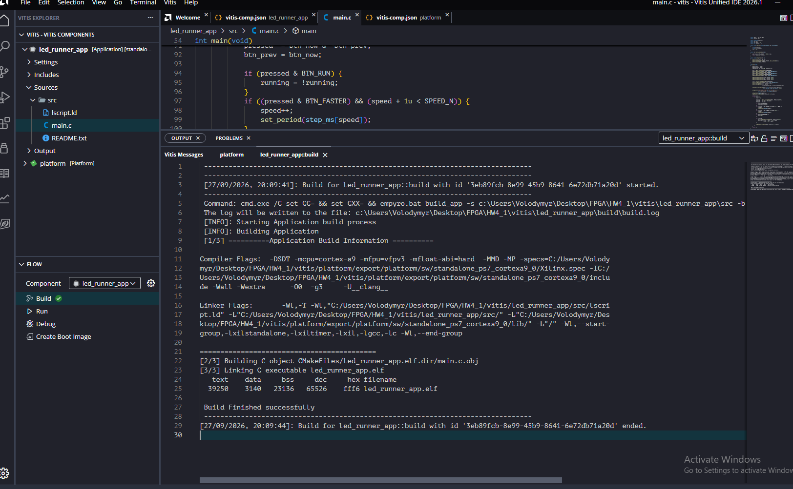

# HW4 - Завдання 1: біжуча доріжка на Zynq PS

Vivado `xc7z020clg400-1` (PYNQ-Z1), Vitis Unified IDE 2026.1.
Плати Zynq немає, тому результат здається як зібраний проєкт + логи Vitis.

## Block Design `led_runner_ps`

Zynq PS + AXI Timer + 3× AXI GPIO. Переривання таймера йде в PS через `IRQ_F2P`.

| IP | Призначення |
|---|---|
| `axi_gpio_0` | LED, 4 біти, All Outputs |
| `axi_gpio_1` | switch, 2 біти, All Inputs |
| `axi_gpio_2` | btn, 4 біти, All Inputs |
| `axi_timer_0` | темп руху, `interrupt` → `IRQ_F2P` |

## Логіка (`vitis/led_runner_app/src/main.c`)

Темп задає AXI Timer в режимі auto-reload з перериванням, програмних затримок циклом немає.
Зміна швидкості = перезапис reload-значення таймера.

- `sw[0]` - напрямок (0 вперед, 1 назад)
- `btn[0]` - пауза / рух
- `btn[1]` - швидше, `btn[2]` - повільніше
- `btn[3]` - повернути доріжку на LED0

## Результат

Bitstream згенеровано, XSA експортовано (`led_runner_ps_wrapper.xsa`), застосунок зібрано:

Повний лог - [logs/vitis_build.txt](logs/vitis_build.txt).
