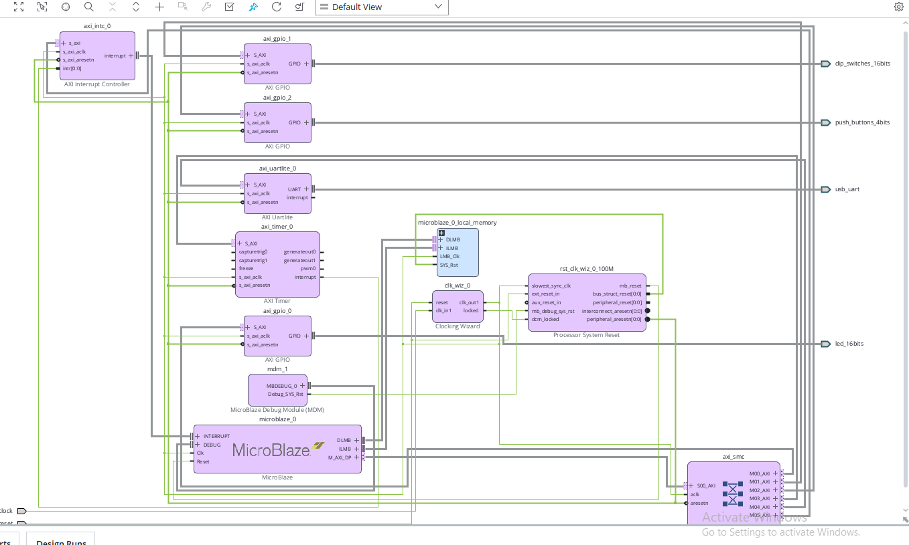
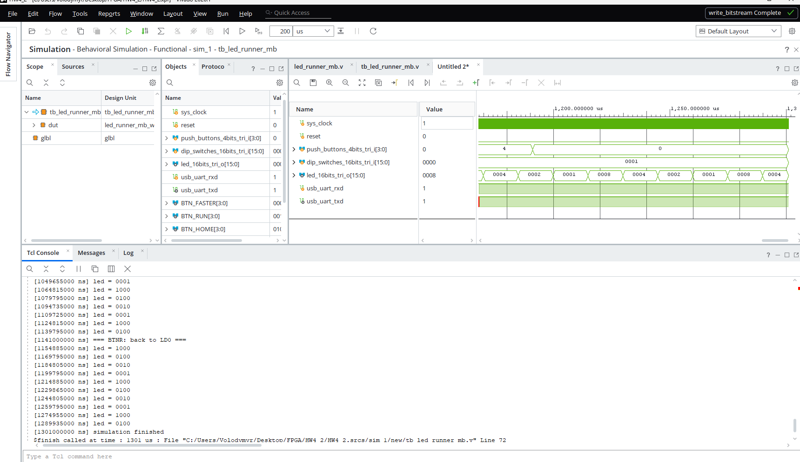

# HW4 - Завдання 2: біжуча доріжка на MicroBlaze

Vivado `xc7a35tcpg236-1` (Basys 3), Vitis 2026.1. Той самий функціонал, що в [HW4_1](../HW4_1/README.md), але на MicroBlaze.

## Block Design `led_runner_mb`

MicroBlaze (64 KB LMB) + Clocking Wizard 100 МГц + AXI Timer + AXI INTC + 3× AXI GPIO + AXI Uartlite.
Переривання: `axi_timer_0` → `axi_intc_0` → `microblaze_0`.

GPIO прив'язані до board-інтерфейсів Basys 3 (`led_16bits`, `dip_switches_16bits`, `push_buttons_4bits`), тому піни приходять із board-файлу і xdc не потрібен.

## Керування

SW0 - напрямок, BTNU - швидше, BTND - повільніше, BTNL - пауза/рух, BTNR - на LD0, BTNC - reset.
Швидкості: 500 / 250 / 120 / 60 / 30 мс.

Темп задає AXI Timer в режимі auto-reload з перериванням; зміна швидкості - перезапис reload-значення. Програмних затримок циклом немає.

Код: [vitis/app_component/src/main.c](vitis/app_component/src/main.c), лог збірки: [logs/vitis_build.txt](logs/vitis_build.txt).

## Робота на платі

[video/basys3.mp4](video/basys3.mp4)

## Симуляція з реальним .elf

Testbench [tb_led_runner_mb.v](HW4_2.srcs/sim_1/new/tb_led_runner_mb.v): скидання, рух вперед, розворот через SW0, пауза і продовження, прискорення, повернення на LD0.

Для симуляції потрібна окрема збірка - у `main.c` розкоментувати `#define SIM_FAST`: крок стає 10-40 мкс замість сотень мілісекунд і вимикається `xil_printf`. Готовий `.elf` - у [sim_elf/](sim_elf/), прив'язується через Tools → Associate ELF Files → Simulation Sources.

