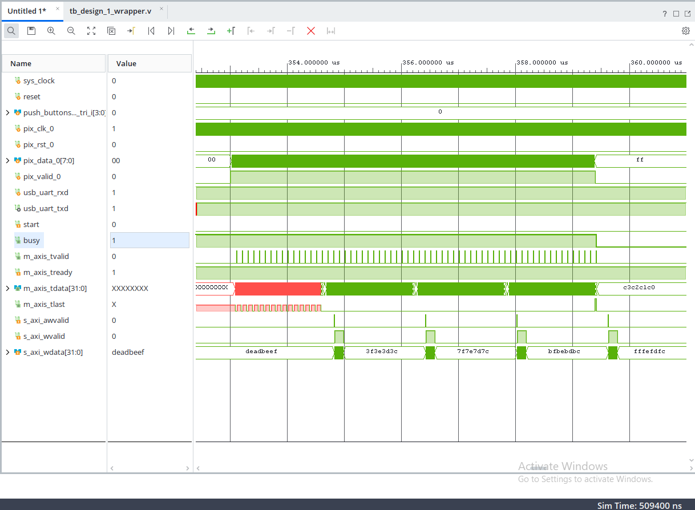

# HW5 - Прийом кадру через DMA в axi4_full_ram

Vivado `xc7a35tcpg236-1` (Basys 3), Vitis 2026.1.
Кадр 320×200 по 8 біт приходить на зовнішні порти, пакується у 32-бітні слова і через AXI DMA лягає в пам'ять. Прийом стартує лише після натискання кнопки.

## Розрахунок пам'яті

320 × 200 = 64 000 пікселів × 8 біт = **64 000 байт** = **16 000** 32-бітних слів.
`axi4_full_ram`: `MEM_DEPTH = 16384` (найближчий степінь двійки), `ADDR_WIDTH = 16` (16384 × 4 = 65 536 = 2¹⁶), `DATA_WIDTH = 32`.

## Модуль `frame_rx`

[frame_rx.v](HW5_1.srcs/sources_1/new/frame_rx.v), запакований як IP у [ip_repo/frame_rx](ip_repo/frame_rx).

Вхідні порти прийому: `pix_clk`, `pix_rst`, `pix_data[7:0]`, `pix_valid`. Окремий тактовий домен - дані приходять на своїй частоті.

Усередині:
- 2-FF синхронізатор для `start` з системного домену;
- пакувальник 4 байт у слово (перший байт у молодших бітах);
- **асинхронний FIFO** з вказівниками в коді Грея - перехід між `pix_clk` і `m_axis_aclk`;
- лічильник слів до `FRAME_WORDS`, на останньому виставляється `tlast`.

Вихід - AXI4-Stream master (`m_axis`) до `S_AXIS_S2MM` у DMA. До сигналу `start` вхідні порти ігноруються; після `FRAME_WORDS` слів модуль сам закривається і чекає наступного старту.

`tlast` їде через FIFO разом із даними (33-й біт), а не рахується на виході - інакше при backpressure мітка кінця кадру роз'їхалася б із даними.

## Система

MicroBlaze (32 KB LMB) + AXI INTC + AXI Uartlite + 2× AXI GPIO + `frame_rx` + AXI DMA + `axi4_full_ram`, усе через SmartConnect.

| Пристрій | Адреса | Призначення |
|---|---|---|
| `axi_gpio_0` | `0x4000_0000` | кнопки (4 біти, board interface) |
| `axi_gpio_1` | `0x4001_0000` | кан. 1 - `start` (вихід), кан. 2 - `busy` (вхід) |
| `axi_dma_0` | `0x41E0_0000` | тільки S2MM, без Scatter Gather, довжина 26 біт |
| `axi4_full_ram_0` | `0x0001_0000` | 64 KB |

DMA підключений другим майстром до того самого SmartConnect, тому пам'ять доступна і йому, і процесору - після прийому MicroBlaze читає її для перевірки.

## Програма

[main.c](vitis/app_component/src/main.c). Порядок принциповий:

1. чекати натискання кнопки;
2. **спочатку** запустити DMA (`XAxiDma_SimpleTransfer`, `XAXIDMA_DEVICE_TO_DMA`);
3. **потім** підняти `start`;
4. дочекатися `busy`, зняти `start`;
5. дочекатися завершення DMA, звірити вміст пам'яті.

Якщо підняти `start` раніше за запуск DMA, перші слова потоку впруться в непідготовлений канал. Очікування `busy` перед перевіркою DMA потрібне тому, що між записом `start` і реальним початком прийому проходить 2-3 такти `pix_clk` - час на перехід між тактовими доменами.

## Перевірка

**Модуль окремо** - [tb_frame_rx.v](HW5_1.srcs/sim_1/new/tb_frame_rx.v): дані до старту ігноруються, слова збираються правильно, `tlast` рівно на останньому, після кадру модуль закривається. Випадкова затримка `tready` на 25% тактів перевіряє backpressure. Різні частоти (40 і 100 МГц) ганяють CDC. Лог - [logs/sim_frame_rx.txt](logs/sim_frame_rx.txt).

**Система** - [tb_design_1_wrapper.v](HW5_1.srcs/sim_1/new/tb_design_1_wrapper.v) з реальним `.elf`, прив'язаним через Associate ELF Files: скидання, натискання кнопки, подача байтів, перевірка вмісту `axi4_full_ram` через ієрархічне посилання. Лог - [logs/sim_system.txt](logs/sim_system.txt).

На waveform видно весь ланцюжок: байти на `pix_valid_0`/`pix_data_0` → 32-бітні слова на `m_axis_tdata` → записи `s_axi_wdata` у пам'ять. Останнє слово `fffefdfc` - байти 252…255, тобто кадр прийнято повністю; `m_axis_tlast` дає імпульс саме на ньому, після чого падає `busy`.

## Як повторити симуляцію

У репозиторії лежить робоча конфігурація - `FRAME_WORDS = 16000`. Для симуляції це недосяжний обсяг (16 000 слів при 100 МГц - це мілісекунди модельного часу з MicroBlaze), тому прогін робився на зменшеному кадрі:

1. `set_property CONFIG.FRAME_WORDS {64} [get_bd_cells frame_rx_0]`, перегенерувати wrapper і XSA;
2. у `main.c` поставити `FRAME_WORDS 64u` і розкоментувати `#define SIM_BUILD` (вимикає `xil_printf`: на 115200 бод один символ - це ~87 мкс модельного часу);
3. перезібрати застосунок, прив'язати `.elf` через Tools → Associate ELF Files → Simulation Sources;
4. `xsim.simulate.runtime` = `all`, Run Behavioral Simulation.

Вигляд вікна хвиль збережено у [tb_design_1_wrapper.wcfg](HW5_1.srcs/sim_1/new/tb_design_1_wrapper.wcfg).
